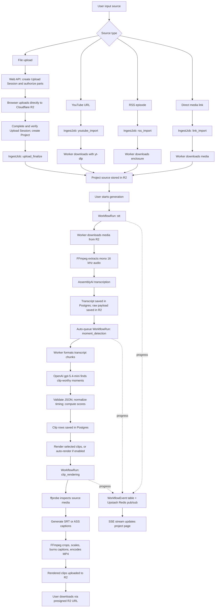

# Narriflow monorepo

Narriflow turns long videos into captioned short clips, with content repurposing, voiceover dubbing, and social publishing. It is a pre-production Bun monorepo.

Start with [local environment files](#local-environment-files), [database setup](#database-setup), and the [local pipeline](#local-pipeline). Use Bun 1.3.6, the version pinned in `package.json` and the worker image.

Current architecture and vocabulary live in [CONTEXT.md](CONTEXT.md) and the [architecture decisions](docs/adr/README.md).

## Repository layout

| Path | Responsibility |
| --- | --- |
| `apps/web` | Next.js App Router, Hono API, Clerk authentication, and remote `/mcp` endpoint |
| `apps/worker` | Media processing, workflow attempts, publishing, and maintenance loops |
| `apps/mcp` | Optional workspace API-key stdio MCP server |
| `packages/services` | Shared domain services and runtime wiring |
| `packages/db` | Prisma schema, migrations, and database client |
| `packages/validators` | Zod schemas, caption constants, and provider capabilities |
| `packages/composition-plan` | Shared Studio preview and export composition policy |
| `packages/mcp-core` | Shared MCP tools, authentication, and transport support |
| `packages/ui` | Chakra UI v3 components and Blueline theme |
| `packages/auth`, `packages/email`, `packages/config` | Shared authentication, email, and configuration |
| `tools/videos` | Separate npm project for marketing videos |

## Stack

- Package manager + task runner: Bun
- Monorepo orchestrator: Turborepo
- Web app: Next.js 16
- API surface: Hono route handlers inside the web app
- Database: Prisma + PostgreSQL
- Background processing: custom Bun worker with independent workflow, publishing, and maintenance loops
- Media storage: Cloudflare R2
- Live workflow events: Upstash Redis pub/sub
- Auth: Clerk
- Speech-to-text: AssemblyAI Universal-3.5 Pro with Universal-2 fallback
- Clip detection: OpenAI Responses API, default `gpt-5.4-mini`
- Voiceover dubbing: OpenAI audio speech + FFmpeg audio replacement
- Rendering: FFmpeg/ffprobe
- Social delivery: durable scheduling queue + native OAuth publishing clients and a supported webhook receiver channel
- MCP: stateless `2026-07-28` Streamable HTTP endpoint at `/mcp`, plus a scoped API-key stdio fallback in `apps/mcp`

## Landing page lab

Seven scroll-driven marketing landing variants live under `apps/web/app/(landing)/lp/*`
(GSAP + ScrollTrigger + Lenis, shared product facts in `_components/landing-data.ts`,
including shared pain-point and comparison data):

- `/lp/blueprint` — porcelain Swiss-editorial (drawn rules, pinned pipeline, caption playground)
- `/lp/studio` — graphite editor-session (scroll = scrubbing, horizontal timeline, render-queue pricing)
- `/lp/signal` — kinetic poster maximalism (ultramarine blocks, odometer score, angled marquees)
- `/lp/atelier` — luxury minimal (huge whitespace, blur-in reveals, scroll-inked statement, hairline pricing)
- `/lp/system` — bento product-first (nine live tiles: video, score cycler, caption presets, ratio morph, publish statuses, autopilot feed)
- `/lp/volt` — electric editorial variant
- `/lp/pop` — neo-brutalist lime/ink (Positivus-style: highlighter pills, hard offset shadows, animated hero collage, interactive 01–06 accordion)

A floating dial on each page switches variants. The looping product videos in
`apps/web/public/videos/` are rendered with Remotion from `tools/videos`.
See [the video project README](tools/videos/README.md) for setup and render commands.

## Before testing

You need these accounts and credentials before the ingest, transcription, clip detection, and rendering flow can be tested end to end:

| Service | Required now | Why |
| --- | --- | --- |
| PostgreSQL / Neon / Supabase Postgres | Yes | Stores projects, ingest jobs, workflow runs, and transcripts |
| Clerk | Yes | Required for sign-in and project ownership |
| Cloudflare R2 | Yes | Stores uploaded files, normalized source media, raw transcription payloads, and rendered clips |
| AssemblyAI | Yes | Required for the transcription stage |
| Upstash Redis | Recommended for real testing | Required for live workflow updates between the separate web and worker processes |
| Resend | Optional for this workflow | Only needed for email/webhook flows |
| Stripe | Optional for Free-plan local testing | Required for paid checkout, entitlements, and billing reconciliation |
| OpenAI | Yes for AI generation | Required for clip detection, content-suite generation, translation, and voiceover dubbing |
| Pexels | Optional | Enables stock B-roll search and automatic B-roll cutaways |
| Native social developer apps | Optional for publishing | Required to connect TikTok, YouTube, Instagram, LinkedIn, and X accounts for native scheduled posting |
| Social publisher webhook | Optional publishing channel | Delivers posts scheduled without a connected account to a configured receiver |

## End-to-end clips workflow

Narriflow turns a source media input into rendered short clips through the background stages below:

1. Ingest: accepts an uploaded file, YouTube URL, direct media link, or RSS episode and stores the normalized source media in Cloudflare R2.
2. Transcription: extracts audio with FFmpeg and submits it to AssemblyAI with Universal-3.5 Pro and Universal-2 fallback. A separate loop polls results. Completed transcripts preserve speaker labels, word timings, the selected model, and automatic language-detection confidence. Source-language options come from the shared validators.
3. Moment detection: sends the completed transcript to OpenAI through the Responses API. The default model is `gpt-5.4-mini`, and the worker requests strict JSON output for clip candidates.
4. Clip rendering: creates subtitle files, crops/scales video for the requested aspect ratios, burns captions with FFmpeg, uploads MP4 renders to R2, and exposes downloads through presigned URLs.
5. Optional voiceover dubbing: translates the clip transcript when needed, synthesizes narration with OpenAI audio speech, swaps the rendered clip audio track with FFmpeg, and uploads MP3/MP4 dub assets to R2.
6. Optional publishing automation: RSS autopilot rules queue new episode imports, and due social posts publish through the selected native OAuth account. Posts without a connected account can still fall back to `SOCIAL_PUBLISH_WEBHOOK_URL`.

The worker runs independent loops for ingest, STT submission and results, moment detection, rendering, dubbing, export bundles, previews, layout analysis, generated media, thumbnail frames, RSS autopilot, and social publishing. Separate maintenance loops handle Upload Sessions, workflow leases and events, billing reconciliation, notifications, retention, and media cleanup. Slow RSS requests do not block due social posts.



## Service responsibilities

| Service or model | Role in the workflow |
| --- | --- |
| Clerk | Authenticates users and gates project access. |
| Cloudflare R2 | Stores source media, raw transcription JSON, and rendered MP4 clips. |
| PostgreSQL + Prisma | Stores projects, ingest jobs, workflow runs, transcripts, clips, render variants, and workflow events. |
| Upstash Redis | Broadcasts workflow events to the web app for live progress updates. Events are also persisted in Postgres. |
| AssemblyAI Universal-3.5 Pro + Universal-2 | Converts extracted audio into transcript text, speaker-separated utterances, punctuation, and word timings. |
| OpenAI `gpt-5.4-mini` | Analyzes transcripts and returns structured clip candidates with timestamps, hook text, category, reasoning, and scores. |
| OpenAI audio speech | Generates voiceover audio for dubbed clips. |
| FFmpeg | Extracts audio for transcription and renders final MP4 clips with cropped video and burned captions. |
| ffprobe | Reads source media stream metadata such as width, height, audio presence, and video presence. |
| yt-dlp | Downloads YouTube sources before they are stored in R2. |
| Pexels | Optional stock video source for B-roll cutaways. |
| Publisher webhook | Optional integration point that receives due social posts and returns posted URLs/metrics. |

## Technical terms

- Ingest: preparing an input source so the rest of the pipeline can process it.
- Workflow run: a queued background stage such as `stt`, `moment_detection`, or `clip_rendering`.
- Ingest job: a queued background task for source preparation, such as YouTube or RSS import.
- STT: speech-to-text.
- Utterance: a timed block of speech, usually a speaker turn or sentence-like segment.
- Diarization: separating speakers in a transcript.
- Word timing: timestamps for individual words, used for accurate captions.
- Content pack: generation preferences such as target clip count, target duration, tone constraints, and caption preset.
- Clip generation mode: the moment detection strategy. The current default is `best`, which keeps a selective ranked set instead of surfacing every possible clip.
- Idempotency key: a request key that helps avoid duplicate queued work.
- SRT: a simple subtitle format with numbered timestamp cues.
- ASS: a richer subtitle format that supports positioning and per-word styling.
- Presigned URL: a temporary URL for uploading or downloading R2 objects without exposing storage credentials.
- SSE: Server-Sent Events, a browser stream used for one-way live updates from the server.
- Pub/sub: publish/subscribe messaging; here, Redis broadcasts workflow events to connected clients.
- Autopilot rule: a saved RSS feed watcher that imports unseen episodes and persists generation settings before ingest finishes.
- MCP server: the stateless Model Context Protocol endpoint at `/mcp`, with OAuth or workspace API-key authentication and a local stdio fallback.

## Local environment files

Use app-local env files instead of inventing a root `.env`.

### Web

Copy [`apps/web/.env.example`](apps/web/.env.example) to `apps/web/.env.local`.

Minimum values for the current clips workflow:

- `DATABASE_URL`
- `CLERK_PUBLISHABLE_KEY`
- `CLERK_SECRET_KEY`
- `NEXT_PUBLIC_CLERK_PUBLISHABLE_KEY`
- `NEXT_PUBLIC_APP_URL`
- `R2_ACCOUNT_ID`
- `R2_ACCESS_KEY_ID`
- `R2_SECRET_ACCESS_KEY`
- `R2_BUCKET`

Notes:

- Upstash is optional. Set `UPSTASH_REDIS_URL` and `UPSTASH_REDIS_TOKEN` in both web and worker for live cross-process workflow events.
- Set `CLERK_OAUTH_ISSUER` for remote MCP OAuth; it is not required for ordinary browser sign-in.
- `CLERK_WEBHOOK_SECRET`, `RESEND_API_KEY`, and `NARRIFLOW_EMAIL_FROM` are only required if you are exercising the Clerk webhook and email path locally.
- Generated stills require `OPENAI_API_KEY`, `OPENAI_IMAGE_MODEL=gpt-image-2`, and the same `GENERATED_MEDIA_PROMPT_ACTIVE_KEY_VERSION`, `GENERATED_MEDIA_PROMPT_ENCRYPTION_KEY`, `GENERATED_MEDIA_PROMPT_DECRYPTION_KEYS_JSON`, and `GENERATED_MEDIA_PROMPT_FINGERPRINT_KEY` in web and worker. Generate the encryption and fingerprint keys independently with `openssl rand -base64 32`. Keep retired encryption keys in the JSON keyring until every prompt encrypted by them passes its 30-day retention deadline.
- Native social OAuth requires `SOCIAL_TOKEN_ENCRYPTION_KEY` plus the provider client IDs/secrets listed in the env example. Register `${NEXT_PUBLIC_APP_URL}/api/social/oauth/callback` as the redirect URI in each provider app.
- Free-project retention must use identical `PROJECT_RETENTION_MODE` and `PROJECT_RETENTION_ENFORCEMENT_STARTED_AT` values in web and worker. Leave the mode at `observe` for at least seven days; enforcement without a valid explicit UTC activation timestamp assigns no deadlines.
- Expansion writes fail closed. Enable only the release group being deployed with `NARRIFLOW_WRITES_BRAND_PROFILES=1`, `NARRIFLOW_WRITES_VISUAL_ASSETS=1`, `NARRIFLOW_WRITES_BRAND_FONTS=1`, `NARRIFLOW_WRITES_BRAND_KIT_PROJECTION=1`, `NARRIFLOW_WRITES_CAMPAIGN_OPERATIONS=1`, `NARRIFLOW_WRITES_SCENE_CARDS=1`, `NARRIFLOW_WRITES_SCENE_IMAGES=1`, `NARRIFLOW_WRITES_SCENE_VIDEOS=1`, `NARRIFLOW_WRITES_SCENE_TEMPLATES=1`, or `NARRIFLOW_WRITES_GENERATED_MEDIA=1`. Review rooms are enabled by the Business plan entitlement and do not use release flags. Disabling another group leaves existing rows readable.
- `EXPORT_BUNDLE_RETENTION_DAYS=7` controls completed ZIP availability and is frozen into each bundle at admission. Accepted values are whole days from 1 through 30.

### Worker

Copy [`apps/worker/.env.example`](apps/worker/.env.example) to `apps/worker/.env`.

Minimum values for the current clips workflow:

- `DATABASE_URL`
- `R2_ACCOUNT_ID`
- `R2_ACCESS_KEY_ID`
- `R2_SECRET_ACCESS_KEY`
- `R2_BUCKET`
- `ASSEMBLYAI_API_KEY`
- `OPENAI_API_KEY`
- `SOCIAL_PUBLICATION_CHECKPOINT_KEY`, at least 32 characters, for the worker's publication loop. Generate with `openssl rand -base64 32`. Provider credentials are only needed when publishing.

Useful runtime settings:

- `WORKER_CLIP_RENDER_ATTEMPT_ENABLED=1` enables rendering for a fresh local setup after migrations. Missing, empty, or `0` leaves render work unclaimed. See the [render operations guide](docs/runbooks/clip-render-attempt-rollout.md) before changing an existing worker pool.
- `PORT=4001`
- `INGEST_POLL_INTERVAL_MS=2500`
- `ASSEMBLYAI_POLL_INTERVAL_MS=5000`
- `ASSEMBLYAI_POLL_TIMEOUT_MS=7200000`
- `OPENAI_CLIP_MODEL=gpt-5.4-mini`
- `OPENAI_IMAGE_MODEL=gpt-image-2` and `OPENAI_IMAGE_QUALITY=medium` for Studio still generation.
- The four `GENERATED_MEDIA_PROMPT_*` values must match the web values. Rotate encryption by moving the old version and key into `GENERATED_MEDIA_PROMPT_DECRYPTION_KEYS_JSON`, assigning a new active version, and generating a new encryption key. Do not rotate the fingerprint key unless prompt idempotency records have been cleared intentionally.
- Unknown generated-image outcomes are inspected and explicitly settled with `bun run --cwd packages/services generated-media:operator -- --workspace <uuid> --job <uuid>`; reconciliation additionally requires `--decision`, `--actor`, and `--reason`.
- `OPENAI_CLIP_REASONING_EFFORT=medium`
- `OPENAI_TTS_MODEL=gpt-4o-mini-tts` and `OPENAI_DUB_TRANSLATION_MODEL=gpt-5.4-mini` for voiceover dubbing.
- `ASSEMBLYAI_KEYTERMS_PROMPT=comma,separated,terms` to opt into deployment-specific names or brands. Terms are trimmed, deduplicated, limited to six words each, and capped at the Universal-2-safe 200-term limit; Narriflow sends no built-in demo vocabulary.
- `WORKER_REAP_INTERVAL_MS=300000` and `WORKER_REAP_STALL_TIMEOUT_MS=1800000` to fail workflow/ingest jobs abandoned by a crashed worker.
- `WORKFLOW_LEASE_REAP_INTERVAL_MS=30000` and `WORKFLOW_EVENT_DISPATCH_INTERVAL_MS=1000` for protocol-v2 Workflow Attempt recovery and durable event delivery.
- `PEXELS_API_KEY=...` to enable stock B-roll search and automatic B-roll cutaways.
- `SOCIAL_TOKEN_ENCRYPTION_KEY` and the social provider client IDs/secrets to refresh tokens and publish scheduled posts natively. Also configure `SOCIAL_PUBLICATION_CHECKPOINT_KEY` with at least 32 characters to protect durable provider checkpoints. See [Social Publication operations](docs/runbooks/social-publication.md).
- Social Publication fixes Meta Graph at `v24.0` and LinkedIn at `202608` as shared web/worker capability contracts. If `META_GRAPH_VERSION` or `LINKEDIN_API_VERSION` is set, it must match that contract; upgrade the shared contract and adapter fixtures together.
- `SOCIAL_PUBLISH_WEBHOOK_URL` and `SOCIAL_PUBLISH_WEBHOOK_SECRET` configure the supported receiver channel for posts scheduled without a connected social account. The worker signs the JSON body as `X-Narriflow-Signature: sha256=...`.
- `AUTOPILOT_BATCH_SIZE=3` to control how many due RSS rules are checked per worker poll.
- `PROJECT_RETENTION_MODE=observe|enforce` and `PROJECT_RETENTION_ENFORCEMENT_STARTED_AT=<UTC ISO timestamp>` control the three-day Free-project policy. Set the same values in the web process, because project deadlines are assigned when projects are created. Batch sizes for warnings, purges, and receipt cleanup default to `100`, `10`, and `100`.

### Native social publishing

Use one callback URL for every provider app:

```text
${NEXT_PUBLIC_APP_URL}/api/social/oauth/callback
```

Required provider products/scopes:

- TikTok: Login Kit and Content Posting API with `user.info.basic`, `video.upload`, and `video.publish`.
- YouTube: YouTube Data API with `https://www.googleapis.com/auth/youtube.upload` and `https://www.googleapis.com/auth/youtube.readonly`.
- Instagram: Meta app with Instagram Graph API/Facebook Login permissions for `instagram_basic`, `instagram_content_publish`, `pages_show_list`, `pages_read_engagement`, and `business_management`; the account must be an Instagram Business or Creator account connected to a Facebook Page.
- LinkedIn: Sign In with LinkedIn/OpenID plus member posting permission `w_member_social`.
- X: OAuth 2.0 with `tweet.read`, `tweet.write`, `users.read`, `offline.access`, and `media.write`.

### MCP

Copy [`apps/mcp/.env.example`](apps/mcp/.env.example) to `apps/mcp/.env`.

Minimum values:

- `DATABASE_URL`
- `NARRIFLOW_API_KEY` set to a scoped Business-workspace key created in **Settings -> Developer access**.

Run the stdio server with:

```bash
bun run dev:mcp
```

The stdio server is optional and is not started by the root `bun run dev`
command. It requires `NARRIFLOW_API_KEY` because it acts as the workspace
identified by that key. The remote HTTP endpoint at `/mcp` is served by the
web app instead and accepts OAuth or scoped workspace API keys.

Available tools:

- `narriflow_list_projects`
- `narriflow_get_project`
- `narriflow_get_workspace_usage`
- `narriflow_list_workspaces`
- `narriflow_list_autopilot_rules`
- `narriflow_create_rss_autopilot_rule`
- `narriflow_run_autopilot_rule_now`

For the remote endpoint, OAuth discovery, Codex/Claude setup, scopes, billing,
and deployment guidance, see [`docs/integrations/mcp.md`](docs/integrations/mcp.md).

## AI clip generation controls

Clip detection settings are stored in the latest content pack for each project:

- Default mode: best clips.
- Default count: 10 clips, configurable from 3 to 30.
- Default preferred duration: 30-60 seconds.
- Default hard duration: 15-90 seconds.
- Default platform targets: TikTok, YouTube Shorts, and Instagram Reels.
- Default render behavior: detection only. Users render selected clips explicitly unless auto-render is enabled.

The worker asks OpenAI for a larger candidate pool than the final clip count, repairs timings against word-level transcript data, deduplicates overlaps, then selects a diverse set across the source timeline. Ranking combines hook strength, emotional intensity, story completeness, pacing, duration fit, and platform scores.

## Third-party setup

### Clerk

1. Create a Clerk application.
2. Enable the sign-in and sign-up methods you want to use locally.
3. Copy the publishable key and secret key into the web env.
4. Add the webhook secret if you plan to exercise the Clerk webhook route locally.

### Cloudflare R2

1. Create an R2 bucket.
2. Create an API token with object read/write access for that bucket.
3. Copy `R2_ACCOUNT_ID`, `R2_ACCESS_KEY_ID`, `R2_SECRET_ACCESS_KEY`, and `R2_BUCKET` into both the web and worker env files.
4. Configure bucket CORS for each deployed web origin: allow `PUT`, allow the `Content-Type` request header, and expose the `ETag` response header. Multipart finalization cannot safely continue if browser JavaScript cannot read each part ETag.
5. Add an R2 lifecycle rule that aborts incomplete multipart uploads after seven days. Set `R2_INCOMPLETE_MULTIPART_LIFECYCLE_DAYS=7` in the worker after verifying the deployed bucket rule. Production workers refuse to start without this confirmation; Narriflow's six-day hard session lifetime and autonomous compensation remain the primary cleanup path.

### AssemblyAI

1. Create an AssemblyAI account.
2. Generate an API key.
3. Set `ASSEMBLYAI_API_KEY` in the worker env.
4. The worker uses `speech_models: ["universal-3-5-pro", "universal-2"]`, `speaker_labels: true`, and `language_detection: true` for Auto mode. Manual mode sends one exact provider `language_code` from the documented enum.

Current multilingual limits are explicit: language-detection confidence is preserved and shown, but no eval-backed threshold blocks downstream work yet; there is no reusable project glossary/language profile, dubbing does not yet perform segment-level duration alignment, and RTL/CJK/Indic caption cue behavior still needs a rendered evaluation matrix. The worker image includes broad Noto core, extra, CJK, and emoji glyph coverage, but fonts alone do not guarantee script-aware cue segmentation.

### OpenAI

1. Create an OpenAI API key.
2. Set `OPENAI_API_KEY` in the worker env.
3. Optionally override clip/content/dub models with `OPENAI_CLIP_MODEL`, `OPENAI_CONTENT_MODEL`, `OPENAI_DUB_TRANSLATION_MODEL`, and `OPENAI_TTS_MODEL`.

### Upstash Redis

1. Create a Redis database.
2. Copy the connection URL/token into both web and worker env files.

Why this matters:

- The worker publishes workflow events.
- The web app subscribes to workflow events for SSE.
- Without Upstash, the page can still recover state from the database on reload, but live progress updates between processes will be missing.

## Local machine dependencies

Install these on the machine that runs the worker:

- `ffmpeg` and `ffprobe`, including caption fonts and libass support
- `yt-dlp`

Why:

- `ffmpeg` is required to extract transcription-ready audio before uploading it to AssemblyAI.
- YouTube imports require `yt-dlp[default]==2026.8.19`, Deno 2.9.5, and the
  bgutil PO-token plugin/server 2.0.0. The worker starts the private token server
  before claiming jobs. Use the worker image locally for matching dependencies;
  native setup and full-download verification are in
  [the YouTube import runbook](docs/runbooks/youtube-import.md).

Face-tracked Automatic, Split, and Screen framing requires Python with `opencv-python-headless` and `numpy`, plus the YuNet model. Set `REFRAME_PYTHON` to the interpreter and `REFRAME_MODEL_PATH` to the model file. The worker image includes these dependencies.

If you use the worker container, [`apps/worker/Dockerfile`](apps/worker/Dockerfile) installs the media tools, caption fonts, OpenCV, and the YuNet model.

## Database setup

Copy [the database env example](packages/db/.env.example) to `packages/db/.env` and configure `DATABASE_URL`. For Neon, use a pooled application connection and set `DIRECT_URL` to the direct connection for migrations. Keep the web and worker pointed at the same database.

Run from the repository root:

```bash
bun install --frozen-lockfile
bun --cwd packages/db run prisma:migrate:deploy
bun --cwd packages/db run prisma:generate
```

`bun install` also generates the Prisma client through its postinstall script. Regenerate it after schema changes. Apply the complete migration chain before starting web or worker.

Run `bun --cwd packages/db run prisma:migrate:dev` only when authoring a new migration against a development database. Use `prisma:migrate:deploy` to apply committed migrations in local, shared, staging, and production environments.

The package commands load `packages/db/prisma.config.ts`, which prefers `DIRECT_URL` over `DATABASE_URL`. They read `packages/db/.env`; the web app's `.env.local` is not loaded by these commands.

## Local pipeline

Set `WORKER_CLIP_RENDER_ATTEMPT_ENABLED=1` in `apps/worker/.env` for local rendering, then run the apps in separate terminals:

```bash
bun --cwd apps/web run dev
```

```bash
bun --cwd apps/worker run dev
```

Or run both through Turbo (the optional stdio MCP server is excluded):

```bash
bun run dev
```

Runtime ports:

- Web: `http://localhost:3000`
- Worker health: `http://localhost:4001/health`

## Test flow

1. Start the web app and worker.
2. Sign in through Clerk.
3. Create a project by upload, YouTube URL, or RSS import.
4. Wait until ingest reaches `ready`.
5. Start transcription from the project page.
6. Confirm the worker claims an `stt` workflow run.
7. Confirm the transcript appears in the project page.
8. Confirm the worker auto-queues and completes `moment_detection`.
9. Confirm detected clips appear in the project page.
10. Confirm the worker auto-queues renders only when auto-render is enabled; otherwise render selected clips manually.
11. Download completed rendered clips from the project page.
12. Export transcript `TXT`, `SRT`, and `VTT` if needed.

## Transcription validation

For a local AssemblyAI transcription test, configure the worker env with `ASSEMBLYAI_API_KEY`, start the web app and worker, ingest a source, and start transcription from the project page. The completed transcript row should show provider `assemblyai`, the raw AssemblyAI JSON should be stored under `projects/{projectId}/transcripts/` in R2, and clip detection should auto-queue without provider-specific changes.

For a quality bakeoff against older archived outputs, run the same source media through the AssemblyAI pipeline and compare:

- full transcript quality
- speaker consistency
- utterance boundaries
- word timestamp alignment
- burned caption sync after FFmpeg rendering
- GPT-5.4-mini clip candidate quality
- total STT cost per hour

## Pre-test checklist

- `DATABASE_URL` points to a live Postgres database.
- All committed Prisma migrations have been applied.
- `WORKER_CLIP_RENDER_ATTEMPT_ENABLED=1` is set for the local render worker.
- Web and worker env files both exist.
- R2 credentials work from both processes.
- `ASSEMBLYAI_API_KEY` is present in the worker.
- `OPENAI_API_KEY` is present in the worker for clip detection.
- Upstash credentials are present in both processes if you want live progress updates.
- `ffmpeg` and `yt-dlp` are installed on the worker host, or you are using the worker container.

## Verification commands

The default commands cover repository lint, type safety, and fast deterministic tests. The web package has active tests. Database suites stay out of the fast aggregate and print as skipped unless you run their disposable-schema command with PostgreSQL configured.

```bash
bun run lint
bun run typecheck
bun run test
```

Run each critical PostgreSQL module against its own disposable schema before handoff:

```bash
bun run test:workflow:db
bun run test:upload-session:db
bun run test:workspace-billing:db
bun run test:social-publication:db
bun run test:clip-editor-persistence:db
bun run test:authenticated-request-policy:db
bun run test:brand-profiles:db
bun run test:vizard-expansion:db
```

Each database runner applies the migration chain, verifies that its connection selected the generated schema, runs only that module's database suite, and removes the schema on success or failure. A skipped suite in `bun run test` is not database verification.

Remote MCP also has `bun run test:mcp:e2e`; see [MCP integration](docs/integrations/mcp.md) for authentication and deployment setup.

Finish a release-quality handoff with the production dependency and build gates:

```bash
bun run audit:production
bun run build
```

Changes to Clip deletion or Studio document behavior also require an authenticated Chrome check. Verify successful deletion, the bounded retry message for `clip_storage_delete_incomplete`, semantic no-op edits, one real dirty edit through cloud acknowledgement, Reset eligibility, Device Draft removal, and a clean console and network log.
