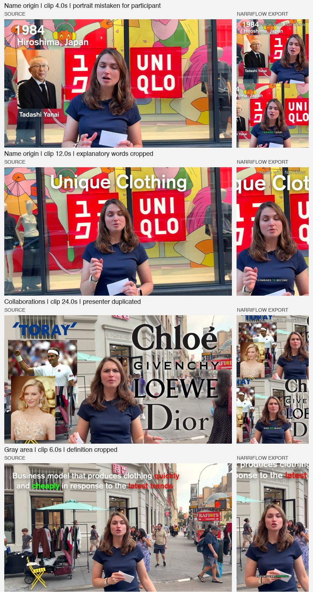

# Uniqlo video: Narriflow test and analysis

Tested on September 14, 2026 (PKT), using only [local Narriflow](http://localhost:3000/projects/804bb8bd-418b-4203-902b-5ec2cc0d007b) and the requested [YouTube video](https://www.youtube.com/watch?v=reKsG2Al6lc), “Inside Uniqlo: The Boring Basics Brand That’s Actually a Tech Company.” No Vizard project was used for this test. Application code and clip edits were not changed during this run.

**Result: 10 clips selected, 9 exported successfully, 1 failed even after retry.** Presenter tracking is generally useful, but the current system is not ready for unattended output on this kind of explanatory video. Photographs cause false participant layouts, important source text is cropped, and Studio can show a different layout from the exported video.

The import used the full video, automatic clip length, 9:16, automatic framing, hook prioritization, and the brand-default caption style. The stored source is 1920×1080 AV1 at 60 fps, 1,310.093 seconds, 503,259,948 bytes. The local free plan produces watermarked 720×1280 exports; that resolution and watermark are expected plan behavior. Transcription completed with one speaker. Detection selected approximately 6:40 of material in ten non-overlapping source intervals.

I inspected all nine completed exports at two-second intervals and near their endings, compared relevant frames against the source, examined stored framing plans and transcript boundaries, and checked a disputed scene directly in Studio. This is a sampled visual review, not a frame-by-frame annotation or a complete listening audit. Clip 10 has only source/transcript analysis because no export exists.

**Confirmed problems**

1. **Pictures are treated as participants.** In “How Uniqlo Got Its Name” at 4.0s, the inserted Tadashi Yanai portrait triggers two-up. The presenter appears in both tiles. In “Borrowing Credibility From The Best,” celebrity photographs cause the same error around 24–26s; at 2s, a printed portrait on a display draws the crop away from the full product label. A high-confidence face detection does not establish that someone is physically participating in the scene.
2. **Face crops discard the explanation.** “Unique Clothing” is cut off at 12s in the name-origin clip. Other examples include the technology wording near the end of “Engineered, Not Trend-Chasing,” the Ariake/RFID overlays, and the fast-fashion definition at 6–8s in “Where The Gray Area Comes In.” No-face graphics often fit correctly; graphics next to a face are not protected.
3. **Studio and export disagree.** At approximately 5.45s in the name-origin clip, the settled Studio preview shows two-up while the downloaded export shows one close-up. Both retain the unchanged automatic framing settings. The preview video's time was 9.455999s, including its documented four-second pre-roll. This is a layout disagreement, not a claim of frame-perfect synchronization between players.
4. **Fit preserves content but is often too small.** A full 16:9 image uses only about 31.6% of a 9:16 canvas's height. Large black margins make product footage, charts, and the presenter on the escalator difficult to read on a phone. Default captions also look small relative to the frame. Blurred padding would improve presentation but would not itself make the information larger or recover cropped text.
5. **One clip never exported.** “The Sweet Spot Other Brands Want” failed with `workflow_unexpected_error`. A retry through the normal UI exhausted three workflow attempts with `workflow_retries_exhausted`; the output row still has no storage key and automatic layout remains pending. Available durable events do not expose the underlying exception, so its root cause is unresolved.

Studio/export evidence at approximately 5.45s: [settled Studio screenshot](assets/uniqlo-framing-test/studio-name-5-45.png), [exported frame](assets/uniqlo-framing-test/export-name-5-45.jpg).

**Every selection**

Rows follow source chronology. Narriflow's default gallery sorts by virality, so its displayed clip numbers differ. Times in the findings column are relative to the individual clip.

| Source interval | Clip | Visual and selection assessment |
| --- | --- | --- |
| 00:00.000–00:34.393 | Uniqlo Is Bigger Than It Looks | Presenter remains visible through the outdoor-to-store sequence. The comparison chart and clothing inserts at roughly 0–3s and 10–15s are preserved with fit, but small. Strong introduction; its ending lists the video's forthcoming ideas rather than resolving one standalone point. |
| 02:52.632–03:20.285 | How Uniqlo Got Its Name | Complete origin/typo story. False portrait-driven two-up around 4s; critical name graphics are cropped at 12s and later. Also the directly verified Studio/export disagreement. Needs correction before export approval. |
| 04:01.326–04:40.943 | Lifewear, Not Fast Fashion | Presenter framing is stable in sampled frames. The LifeWear definition sign at 30–34s is retained with fit. The opening carries about 0.1s of the preceding shot. The selection explains its central idea, although much of its 40s is setup. Its broad fast-fashion claim is qualified elsewhere in the source. |
| 05:24.771–05:57.722 | Engineered, Not Trend-Chasing | Clear Zara/H&M/Uniqlo comparison. Store and technology inserts are preserved, but most of the clip becomes a small landscape strip. Text accompanying the presenter near 30–33s is cropped. The many tiny plan segments during the H₂O animation follow scene-detector changes while remaining fit; they are not evidence of visible camera jumps by themselves. |
| 06:54.058–07:49.564 | The Fleece Jacket That Changed Everything | Strong product story and numerical payoff; longest selection at 55.5s. Presenter tracking survives substantial movement. The sales chart around 44–50s is retained but small. Product/price information is often outside the face crop, and a brief fit change around 14s disrupts the otherwise close framing. Opening contains about 0.2s of the preceding shot. |
| 11:08.051–11:57.084 | The Takumi Team | Sampled presenter framing remains usable outside and inside the store, including near the background display. The clip begins with the unexplained “It's also about where they make it.” Its manufacturing argument is useful but overlaps thematically with the later gray-area clip. |
| 13:25.803–14:11.923 | Ariake Project And RFID | Coherent operations story. Presenter stays visible; checkout demonstration at about 22–26s and product footage near the end fit. Ariake/RFID text next to the presenter is cropped. The transcript contains “what items Then” around 39s, which needs checking against audio; this is inside the clip, not a cut-off ending. The last word ends at source 851.706s, before the selected end at 851.923s. |
| 16:55.414–17:38.743 | Borrowing Credibility From The Best | The weakest framing result. Portrait-driven split at the opening, a crop attracted to a printed portrait at 2s, and duplicated presenter views at 24–26s. Partner names are also partially lost. The argument has a conclusion, but its opening refers to collaborations introduced before this selection. |
| 18:33.597–19:16.192 | Where The Gray Area Comes In | Useful qualified conclusion. The definition is retained in fit at 2–4s, then cropped at 6–8s. Product details are preserved. Roughly the final 19s use fit for the crowded escalator scene, keeping the setting but making the presenter very small. Opening “But producing cheaply?” depends on earlier context. |
| 20:14.413–20:43.108 | The Sweet Spot Other Brands Want | Export failed on the initial run and retry; no rendered framing assessment is possible. Source/transcript suggest a wide store/escalator conclusion. “Despite this challenge” has no antecedent within the clip. A later opening around source 20:26.7 is a candidate to review, not a validated edit. |

All selections avoid the approximately 08:46–10:21 sponsor block and the later outro. None are exact source-interval duplicates. Several clips still rely on preceding context, so exclusion of sponsor material is not sufficient evidence of good standalone selection. Virality scores are model estimates, not measured audience outcomes.

**What the framing data shows**

The nine completed *stored Studio plans* contain 124 segments over 371.197 seconds: 264.628s tracked single (71.3%), 99.786s fit (26.9%), and 6.783s two-up (1.8%). Two-up occurs only in the name-origin and collaborations clips, where the sampled examples are photograph-driven. These are plan statistics, not exact measurements of exported layout duration, because the preview/export disagreement is confirmed.

The crop generally follows the real presenter through walking, leaning, and changes of source camera position. I did not observe complete subject loss in the sampled presenter shots. That does not establish perfect tracking between samples. The main demonstrated weakness is choosing what deserves framing, rather than the ability to move a crop.

The parity problem has an identifiable architectural path: background analysis in `apps/worker/src/tasks/auto-layout-analysis.ts` uses the 960×540 preview proxy. A foreground render in `apps/worker/src/tasks/render-clips.ts`, when durable evidence is missing, can immediately analyze its source path and use that separate plan. Shared composition geometry does not ensure identical plans when detector inputs and completion order differ.

**Recommended implementation order**

1. Make one persisted automatic framing plan authoritative for a clip revision, and require both Studio and export to consume it. A deterministic regression should cover the observed 5.45s mismatch and concurrent analysis/render startup.
2. Treat inserted photographs, display portraits, text overlays, and product demonstrations as composition evidence. Do not admit every detected face as a participant. Use a targeted scene assessment where ordinary face tracking is ambiguous, with explicit readable regions that a crop must preserve.
3. Choose framing for the explanation: the presenter, the demonstrated item, and essential text may all matter. Use fit when the full frame is needed; use a larger safe detail crop where the informative region can fill more of the vertical canvas. Avoid full-shot crowd rules that indiscriminately treat background shoppers as co-presenters.
4. Anchor selection boundaries to complete thoughts and nearby source cuts without sacrificing words. Remove brief preceding-shot flashes, unresolved pronouns, and teaser-only selections where a complete argument is available.
5. Capture the underlying render exception in safe structured diagnostics and make the failed escalator clip a regression case. Do not classify the cause as a media, tracking, or infrastructure bug until the exception is recovered or reproduced.

This test does not justify claiming perfect framing or universal superiority over another product. It gives concrete failures and acceptance cases for the next implementation.

**Run evidence**

The original render run `d8d66227-ab7a-4c22-97ec-02f41ff7e285` settled partial, 9/10. Retry run `56a96a4b-d43e-4223-9ec6-31250d7ae83f` requested only the failed clip and settled failed after three attempts. The initial project creation to partial render completion took approximately 17m35s, including import, transcription, detection, and rendering. This is one local run, not a throughput benchmark.

Full local evidence is under `/tmp/narriflow-uniqlo-review/`: `evidence.json` preserves metadata, current plans and retry history; `renders/` contains nine completed exports; `contacts/clip-0-exact.jpg` through `clip-8-exact.jpg` show frame-PTS samples; `contact-sheets/` contains paginated accurate-seek samples through each ending; `source/`, `source-contacts/`, and `proof/` hold source comparisons. Temporary evidence may be cleaned up by the system; the key visual failures are copied beside this report.
